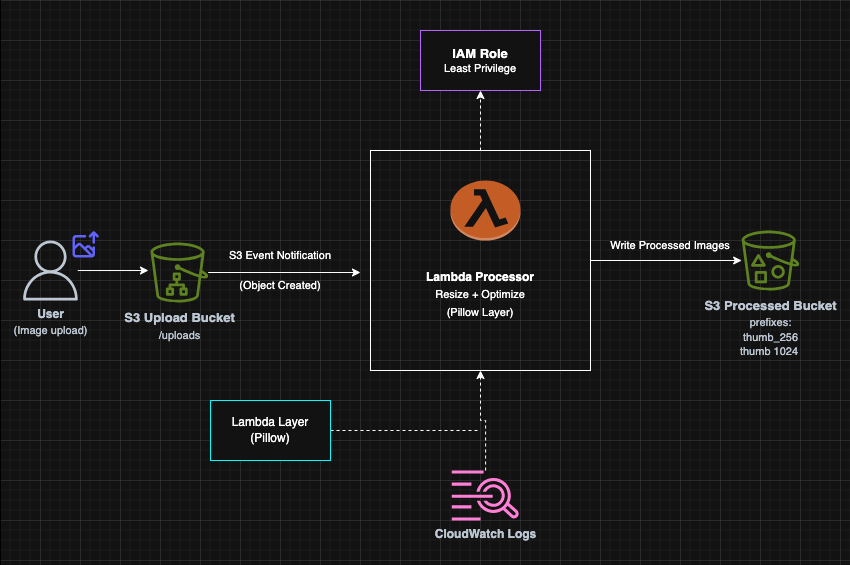
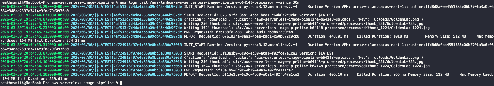

# Event-Driven Image Processing Pipeline on AWS (Terraform)

A production-grade, serverless image processing pipeline built on AWS using Terraform.

## What This Project Demonstrates
- Event-driven serverless architecture on AWS
- Infrastructure as Code (Terraform)
- Production-oriented design (IAM, observability, DLQ, idempotency)

---

## Architecture

Upload → S3 Event → Lambda → Process → Output Bucket



---

## Architecture Decisions

### Why S3 Event Notifications?
S3 provides a native, scalable trigger mechanism that eliminates polling and enables immediate event-driven processing.

### Why AWS Lambda?
Lambda enables on-demand compute for burst workloads with no infrastructure management.

### Why Separate Buckets?
- Prevents recursive triggers  
- Isolates raw vs processed data  
- Improves security boundaries  

### Why Lambda Layers?
- Keeps deployment package small  
- Improves reusability  
- Simplifies dependency management  

### Why Terraform?
- Reproducible infrastructure  
- Version-controlled architecture  
- Environment consistency  

---

## How It Works

1. User uploads image to `incoming/`
2. S3 triggers Lambda (prefix-filtered)
3. Lambda:
   - Validates file type and size
   - Downloads image
   - Generates:
     - 256px thumbnail
     - 1024px resized image
   - Converts to optimized JPEG
4. Outputs written to:
   - `processed/thumb_256/`
   - `processed/thumb_1024/`
5. Logs, metrics, and alarms captured in CloudWatch

---

## Data Flow

- Input: `incoming/<filename>`
- Output:
  - `processed/thumb_256/<filename>-256.jpg`
  - `processed/thumb_1024/<filename>-1024.jpg`

---

## Key Features

- Fully serverless architecture
- Event-driven processing
- Prefix-filtered triggers
- Image resizing and optimization
- Idempotent processing (HeadObject checks)
- Structured logging
- CloudWatch alarms and dashboard
- SQS Dead Letter Queue (DLQ)
- Secure IAM (least privilege)
- Terraform IaC

---

## Observability

- Structured logs in CloudWatch
- Error tracking
- Duration monitoring
- Dashboard visualizing:
  - Invocations
  - Errors
  - Duration
  - Throttles

---

## Failure Handling

- Invalid files rejected
- Size limits enforced
- Errors logged with context
- Failed events sent to SQS DLQ
- Replay capability via script

---

## DLQ Replay

Replay failed events:

```bash
./scripts/replay_dlq.py \
  --queue-url "$(cd terraform && terraform output -raw lambda_dlq_url)" \
  --delete-message
```

---

## Demo

### Original Image


### 256px Thumbnail


### 1024px Thumbnail


### Logs


---

## Testing

```bash
UPLOADS_BUCKET=$(terraform output -raw uploads_bucket)
PROCESSED_BUCKET=$(terraform output -raw processed_bucket)

aws s3 cp ./test.jpg s3://$UPLOADS_BUCKET/incoming/test.jpg
```

---

## Deployment

```bash
cd terraform
terraform init
terraform plan -out=tfplan
terraform apply tfplan
```

---

## Security

- Private S3 buckets
- Public access blocked
- Least-privilege IAM
- Scoped Lambda permissions
- No long-lived credentials

---

## Cost

- Pay-per-use Lambda
- S3 storage only
- DLQ negligible cost

---

## Future Enhancements

- CI/CD pipeline (GitHub Actions + OIDC)
- Multi-region deployment
- Advanced transformations
- Metadata tracking (DynamoDB)
