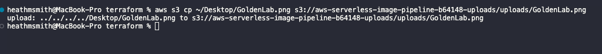
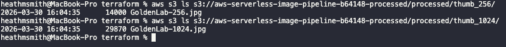

# Event-Driven Image Processing Pipeline on AWS (Terraform)

A serverless, event-driven image processing pipeline built on AWS using Terraform.

This project demonstrates how user-uploaded images can be automatically processed using S3 event notifications and AWS Lambda, without requiring servers or manual orchestration.

Images are resized and optimized for web delivery upon upload, then stored in a separate processed bucket.

## Architecture

Upload → S3 Event → Lambda → Process → Output Bucket


## How It Works

1. A user uploads an image to the S3 uploads bucket
2. S3 triggers a Lambda function via event notification
3. Lambda:
   - Downloads the image
   - Generates:
     - 256px thumbnail
     - 1024px resized image
   - Converts output to optimized JPEG format
4. Processed images are written to the processed bucket
5. Logs are captured in CloudWatch for observability

## Key Features

- Fully serverless architecture
- Event-driven processing (no polling)
- Automatic image resizing and optimization
- Secure IAM with least-privilege access
- Lambda layers for dependency management (Pillow)
- Infrastructure provisioned with Terraform

## Demo

### Original Image


### 256px Thumbnail


### 1024px Thumbnail


### Pipeline Execution


### Output


### Logs


## Testing
````
UPLOADS_BUCKET=$(terraform output -raw uploads_bucket)
PROCESSED_BUCKET=$(terraform output -raw processed_bucket)

aws s3 cp ./test.jpg s3://$UPLOADS_BUCKET/test.jpg

aws s3 ls s3://$PROCESSED_BUCKET/processed/thumb_256/
aws s3 ls s3://$PROCESSED_BUCKET/processed/thumb_1024/

````

## Deployment

````
cd terraform

terraform init
terraform plan -out=tfplan
terraform apply tfplan

````

## Security Design

- S3 buckets are not publicly accessible
- Access is restricted via least-privilege IAM policies
- Lambda can only read from uploads and write to processed bucket
- No direct access to processed outputs without explicit permissions

## Why This Architecture Matters

This project demonstrates a fully event-driven architecture using AWS-native services.

By leveraging S3 event notifications and Lambda, the system eliminates the need for polling or manual workflows, allowing scalable, automatic processing of uploaded content.

This pattern is widely used in real-world applications such as:
- Image thumbnail generation
- Media processing pipelines
- Content ingestion systems

## Future Enhancements

- Dead Letter Queue (SQS) for failed processing
- Structured JSON logging
- CI/CD pipeline using GitHub Actions + OIDC
- Support for additional file types and formats